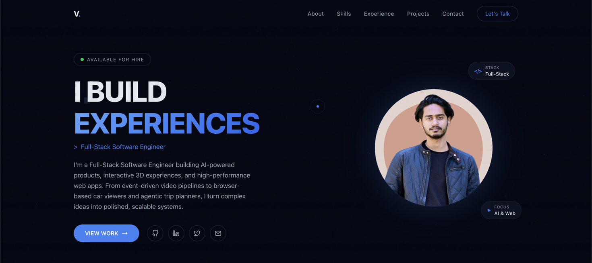

<div align="center">

<a href="https://vishalpundhir.site">
  
</a>

<br/>

# Hi, I'm Vishal Pundhir 👋

### Full-Stack Software Engineer · AI Agents · 3D on the Web

<p>
  <a href="https://vishalpundhir.site"></a>
  <a href="https://www.linkedin.com/in/vishal-pundhir-31059b197/"></a>
  <a href="mailto:vishalpundhirofficial@gmail.com"></a>
  
</p>

</div>

---

```ts
const vishal = {
  role:     "Full-Stack Software Engineer @ Spyne",
  location: "Gurugram, India",
  building: ["LLM agent harnesses", "event-driven video pipelines", "3D car viewers"],
  stack:    ["Node.js", "React", "Python", "AWS", "Three.js", "LangGraph"],
  currently:"turning complex ideas into polished, scalable systems",
};
```

## 🚀 What I Do

I build **AI-powered products, interactive 3D experiences, and high-performance web apps** — from event-driven video pipelines and agentic trip planners to browser-based car viewers running on WebGL.

- 🎥 **Automated Feature Video** at Spyne — event-driven microservices (Kafka · SQS · Lambda) rendering **1000+ videos/month at 99.9% uptime**
- 🧠 **LLM content pipeline** — structured, TTS-safe script generation with config-driven scene, text and voiceover template layers
- ⚡ **After Effects automation** — car data injected into AE templates via AWS Deadline Cloud, cutting video creation from **2 hours → 5 minutes**
- 🌐 **Interactive 3D car viewer** — 360° video turned into browser 3D models with Three.js: **+45% engagement, +30% conversion**
- 🛰️ **Serverless AI pipeline** — Step Functions + Batch processing **500+ videos daily** for frame extraction, stabilization and 3D point clouds
- 🔧 **Perf work** — embed load time down **3–4s → 2–10ms** and CPU usage **−60%** across 200+ dealer websites

## 🧰 Tech Stack

**AI & Agents**


<sub>Tool calling & orchestration · context engineering · memory systems · structured outputs · SSE streaming</sub>

**Backend**


**Frontend**


**Cloud & DevOps**


## 🧪 Featured Projects

<table>
<tr>
<td width="50%" valign="top">

### 🗺️ [ItineraryAI](https://itineraryai.in/)
**Agentic trip planner · LangGraph harness**

[](https://itineraryai.in/)

A `planner → tools → critic` loop with conditional routing, typed agent state and a self-repair cycle. Three research tools run in parallel with per-tool fault isolation, backed by a ChromaDB RAG cache (30-day TTL) that kills redundant search calls. Progress streams over SSE from a FastAPI service on EC2.

`LangGraph` `FastAPI` `ChromaDB` `SSE` `AWS`

</td>
<td width="50%" valign="top">

### 🧠 LLM Wiki
**Persistent memory layer for coding agents**

A "second brain" that gives LLMs memory across sessions — used daily with Claude Code. Hierarchical `CLAUDE.md` context discovery scopes multi-repo setups so agents load only what's relevant, keeping context windows small and precise.

`Claude Code` `Context Engineering` `Memory Systems`

</td>
</tr>
</table>

## 🎨 Beyond Code

When I'm not shipping, I'm designing — After Effects, Premiere Pro, Illustrator and Figma. UI designs, logos, ad creatives and product promos. The visual side is why my 3D and motion work tends to look as good as it performs.

---

<div align="center">

**Open to interesting problems in AI, 3D and scalable systems.**

<a href="https://vishalpundhir.site"></a>

<sub>🎓 B.E., BITS Pilani '24 · 📍 Gurugram, India</sub>

</div>
